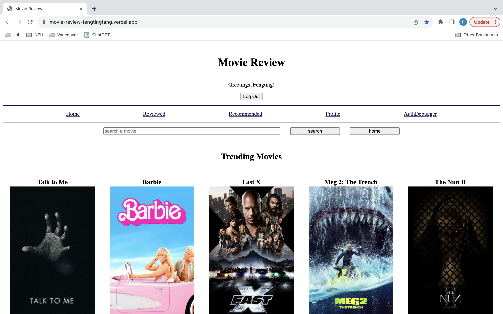
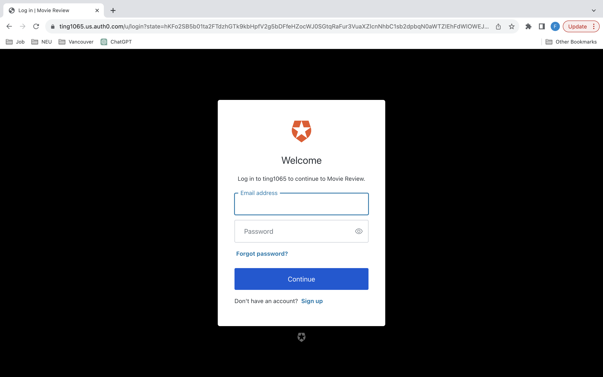
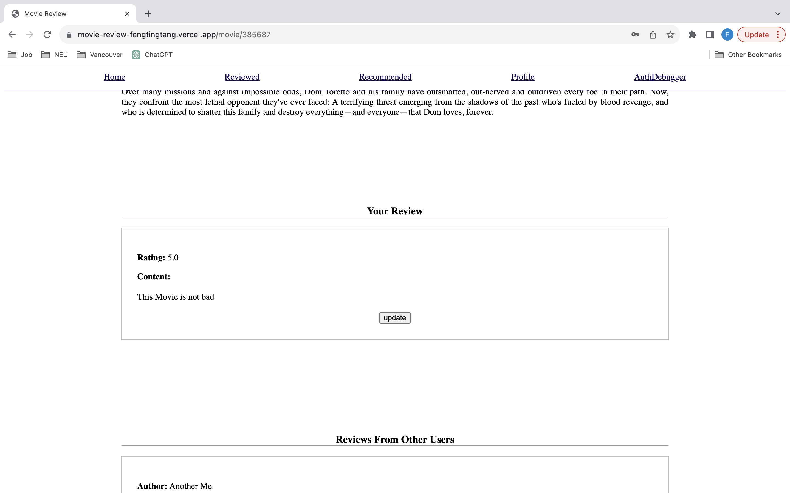
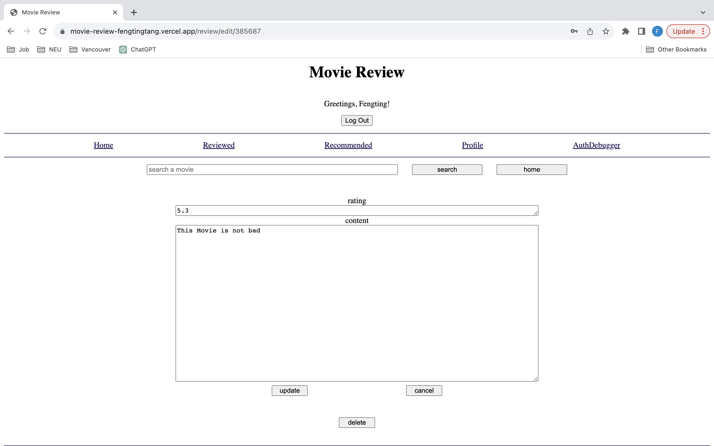
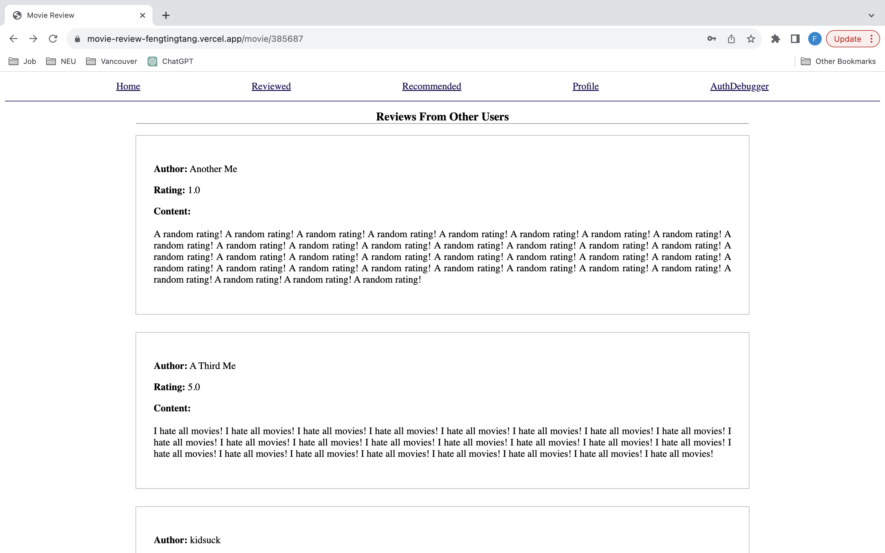
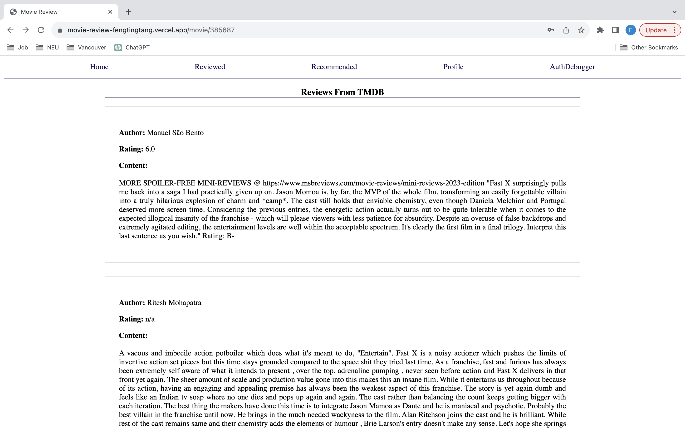
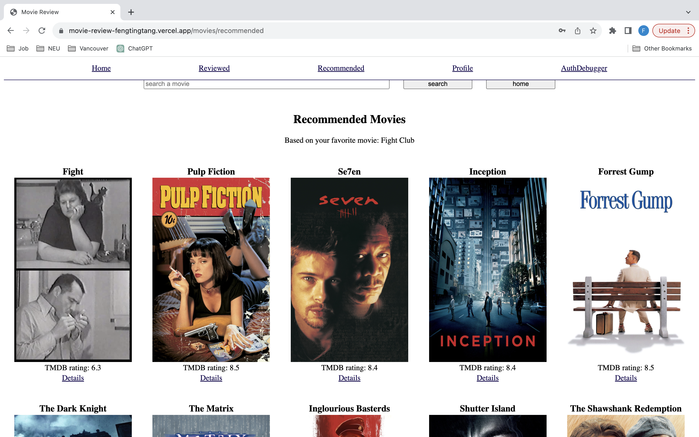
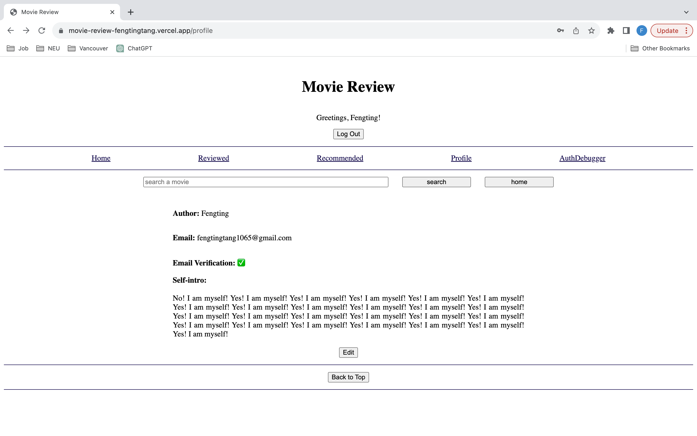
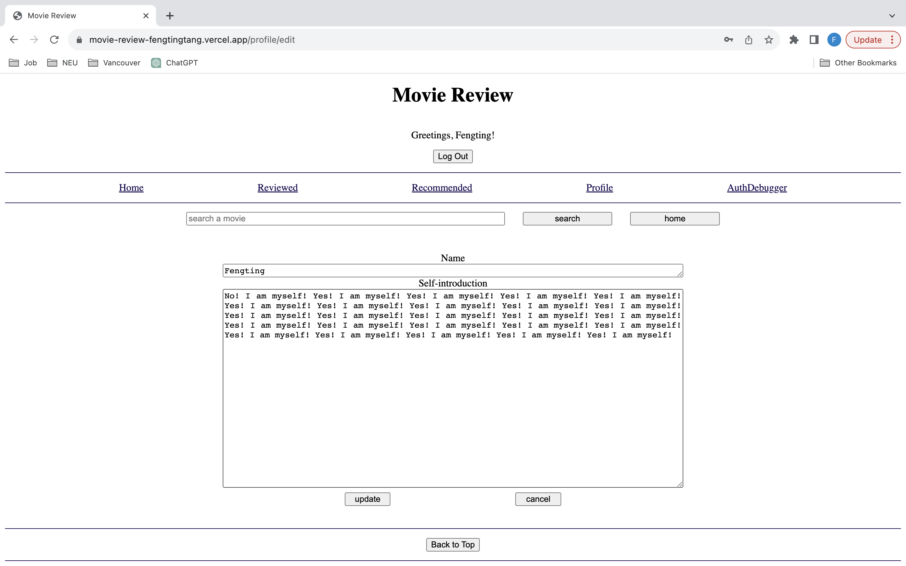
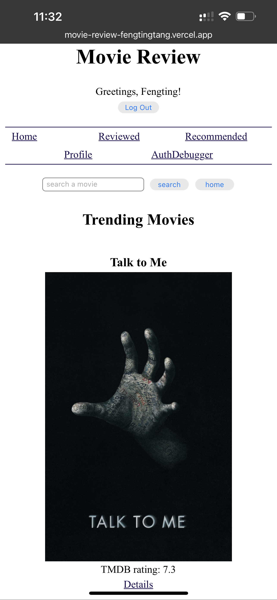

# Movie Review Website

## Tech Stacks

## Features

- **User Authentication**: sign up, login in, log out, and specific features based on user status
    

- **Write Review**: rate and comment a movie, and corresponding CRUD operations
    
    

- **Check Review**: check other users' review and reviews from TMDB
    
    

- **Recommend Movie**: recommend 20 movies based the user's highest rated movie
    

- **Search Movie**: search a movie by name
    

- **Edit Profile**: edit the current user's name and intro
    
    

- **Responsive Design**: dynamic layout based on screen size
    