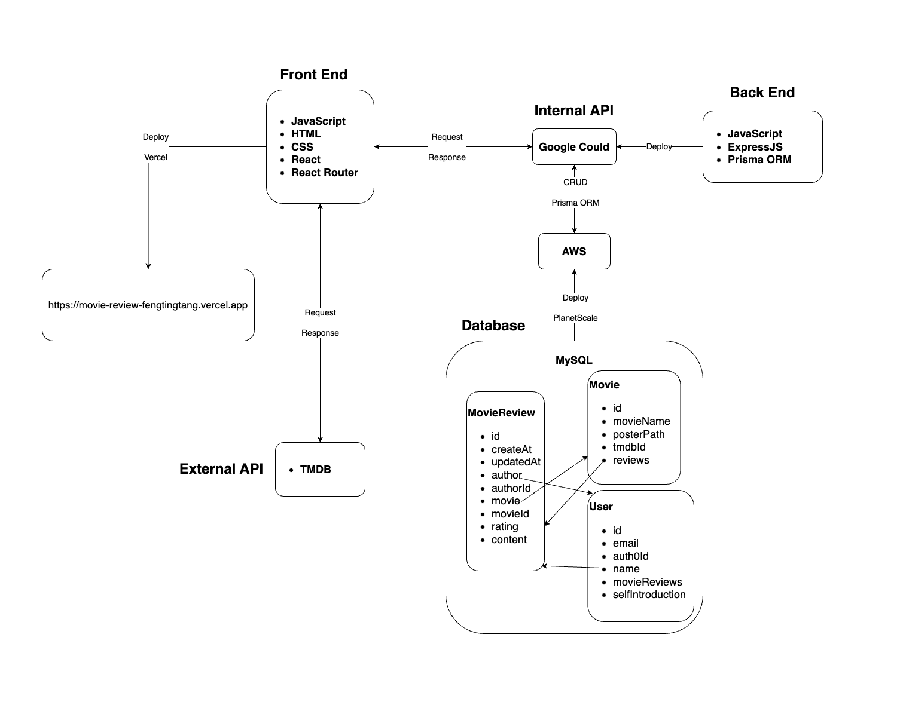

# Movie Review Website
 

 

## Tech Stacks

 

## Features

- **User Authentication**: sign up, login in, log out, and specific features based on user status

     

- **Write Review**: rate and comment a movie, and corresponding CRUD operations

     

     

- **Check Review**: check other users' review and reviews from TMDB

     

     

- **Recommend Movie**: recommend 20 movies based the user's highest rated movie
     

- **Search Movie**: search a movie by name

     

- **Edit Profile**: edit the current user's name and intro

     

     

- **Responsive Design**: dynamic layout based on screen size

     